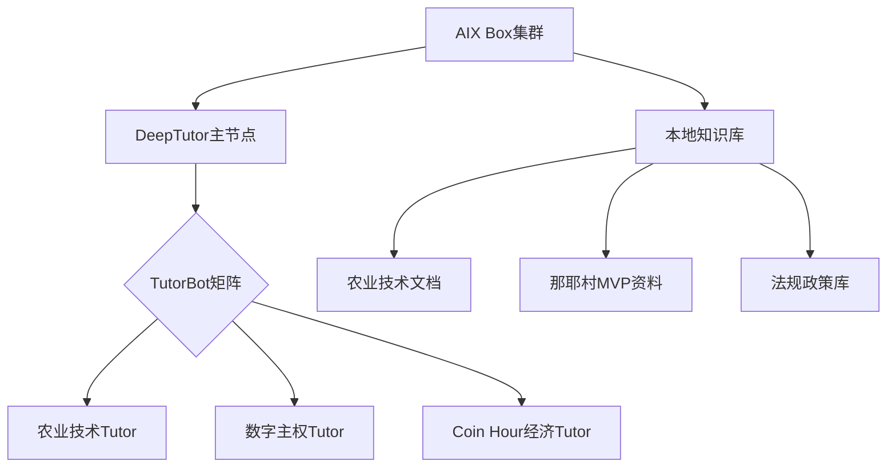
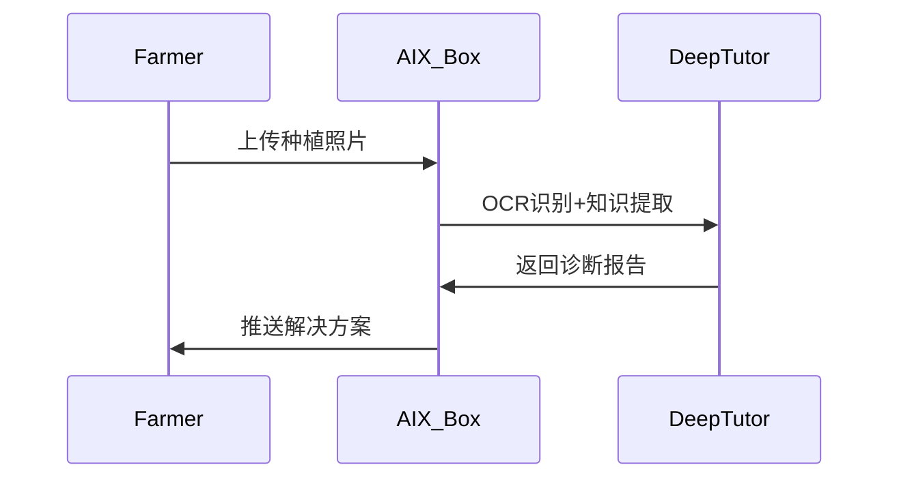

# DeepTutor × AIX Box 集成部署方案

## 一、系统架构设计


## 二、TutorBot矩阵设计

### 1. 农业技术Tutor
**功能：**
- 上传PDF版《现代农业技术手册》自动索引
- 解答种植/养殖技术问题
- 生成那耶村特色作物种植方案

**知识库结构：**
```json
{
  "domain": "农业技术",
  "sources": [
    {"type": "pdf", "path": "agri-tech-manual.pdf"},
    {"type": "md", "path": "rice-cultivation.md"}
  ],
  "index_fields": ["作物名称", "病虫害", "施肥方案"]
}
```

### 2. 数字主权Tutor
**功能：**
- Coin Hour经济系统问答
- AIX Box操作指南
- 数据隐私保护培训

**交互示例：**
```
用户：如何保护我的农产品销售数据？
TutorBot：
1. 在AIX Box创建加密知识库
2. 使用零知识证明验证访问权限
3. 通过UTXO账本追踪数据流向
```

## 三、AIX Box集成方案

### 1. 硬件部署
```bash
# 那耶村部署示例（3节点集群）
aix-cluster init --name naya-village --nodes 3
aix-cluster deploy deeptutor-gateway
aix-cluster deploy knowledge-sync
```

### 2. 知识库同步机制

