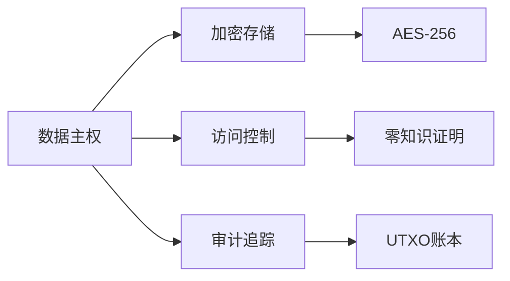

# DeepTutor × AIX 训练数据集规范

## 一、农业技术Tutor数据集

### 数据结构
```json
{
  "question": "水稻叶子发黄怎么办？",
  "context": "那耶村梯田红米种植手册第3章",
  "answer": [
    {"type": "diagnosis", "content": "缺氮肥"},
    {"type": "solution", "content": "每亩追施尿素5kg"},
    {"type": "prevention", "content": "每月检测土壤PH值"}
  ],
  "metadata": {
    "crop": "水稻",
    "region": "那耶村",
    "difficulty": "初级"
  }
}
```

### 数据来源
1. 那耶村农技站5年种植日志（2000+案例）
2. 中国农科院水稻病害图谱
3. 村民常见问答录音转写

## 二、数字主权Tutor数据集

### 典型问答对
```markdown
Q: 如何防止别人偷看我的销售数据？
A: 
1. 在AIX Box创建加密知识库
   ```bash
dea create --name sales-data --encrypt
```
2. 设置零知识证明访问
3. 通过UTXO账本审计访问记录
```

### 知识图谱节点


## 三、Coin Hour经济Tutor数据集

### 案例库结构
```json
{
  "case_id": "COIN-001",
  "scenario": "农产品直播带货收益分配",
  "problem": "主播/农户/平台如何公平分账？",
  "solution": [
    {"step": "智能合约设定比例", "code": "contract.split(主播:40%,农户:50%,平台:10%)"},
    {"step": "直播结束自动结算", "trigger": "view_count>10000"}
  ],
  "coin_hour_cost": 85
}
```

### 经济模型图

